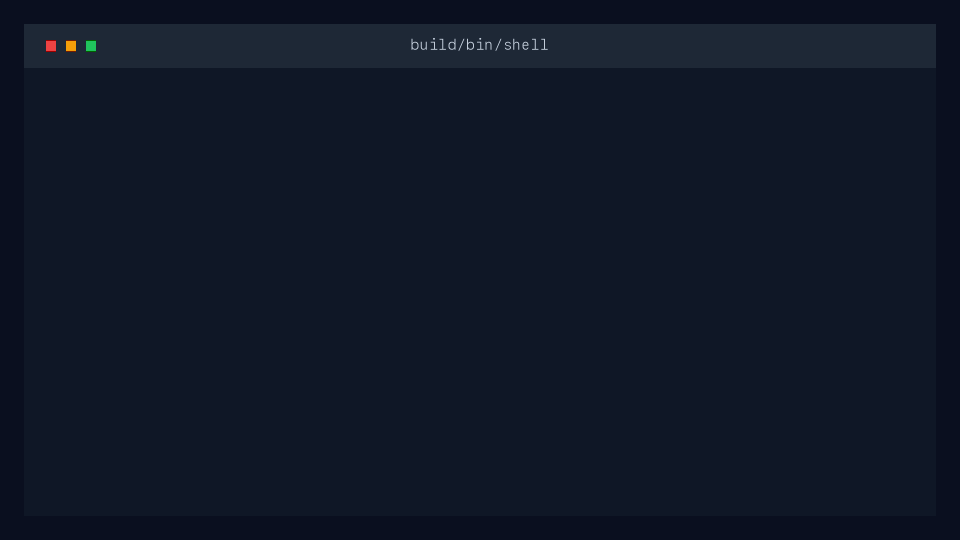
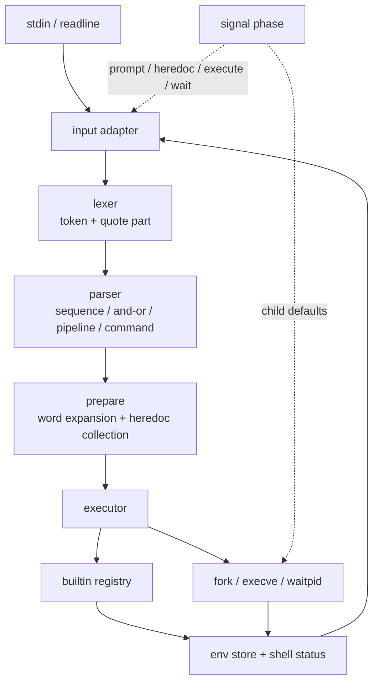

# Interactive Shell

> C로 구현한 POSIX 스타일 인터랙티브 셸입니다. 입력 어댑터, lexer/parser, expansion, heredoc, redirection, pipeline, builtin, signal phase를 분리해 작은 셸 런타임을 끝까지 연결했습니다.


## Demo



## 핵심 기능

- Interactive / non-interactive 입력을 같은 adapter 인터페이스로 처리
- `readline` 프롬프트, command history, EOF / `exit` 종료 흐름
- quote 상태를 보존하는 lexer와 word part 조립
- simple command, redirection, pipeline, `&&`, `||`, `;` precedence parser
- `$VAR`, `$?` parameter expansion과 single quote expansion 차단
- `<`, `>`, `>>`, `<<` redirection과 quoted heredoc delimiter 정책
- PATH 탐색 기반 `execve` 실행, wait status를 shell exit status로 변환
- `echo`, `pwd`, `env`, `true`, `false`, `cd`, `export`, `unset`, `exit` builtin
- parent-state builtin은 단독 명령에서 부모 프로세스 상태를 직접 갱신
- prompt, heredoc, child 실행, pipeline wait 단계별 signal disposition 분리
- builtin, pipeline, redirection, heredoc, control flow를 검증하는 integration smoke test

## 빠른 시작

### 요구 사항

- POSIX 호환 환경
- C 컴파일러(`cc`)
- `make`
- GNU Readline 개발 라이브러리

macOS에서 Readline 경로가 기본 linker 경로에 없다면 환경에 맞게 `CPPFLAGS`, `LDFLAGS`, `LDLIBS`를 함께 넘겨 빌드합니다.

```sh
make
make run
```

Non-interactive 모드는 stdin을 통해 바로 확인할 수 있습니다.

```sh
printf 'echo hello | tr h H\n' | ./build/bin/shell
```

테스트는 현재 구현 범위를 smoke suite로 검증합니다.

```sh
make test
```

주요 Make target은 다음과 같습니다.

| Target | 설명 |
| --- | --- |
| `make` | `build/bin/shell` 빌드 |
| `make objects` | source object만 컴파일 |
| `make run` | interactive REPL 실행 |
| `make test` | integration smoke test 실행 |
| `make clean` | object 정리 |
| `make fclean` | `build/` 전체 정리 |
| `make re` | clean build |

## 아키텍처



### 디렉터리 구조

```text
include/shell/          public module contracts
include/shell/support/  allocation, string buffer, vector, identifier, path helpers
src/core/               shell context, input adapter, env store, expansion, prepare, signal
src/parse/              lexer, AST, parser
src/exec/               executor, path resolution, redirection and pipeline runtime
src/builtin/            builtin registry and implementations
tests/integration/      end-to-end smoke tests
docs/assets/readme/     README demo assets
```

## 기술적 결정

- Lexer에서 quote 정보를 버리지 않고 word part로 보존했습니다. 덕분에 parser 이후 prepare 단계에서 single quote만 expansion을 차단할 수 있습니다.
- AST를 `simple command -> pipeline -> and/or -> sequence`로 나누어 shell operator precedence를 자료구조 자체에 반영했습니다.
- Expansion과 heredoc 수집은 실행 직전 prepare 단계로 모았습니다. Parsing은 구조만 만들고, runtime 상태가 필요한 `$?`와 env lookup은 shell context를 가진 단계에서 처리합니다.
- `cd`, `export`, `unset`, `exit`처럼 부모 상태를 바꾸는 builtin은 단독 명령일 때 parent에서 실행합니다. Pipeline stage에서는 child에서 실행되어 일반 셸의 상태 격리와 맞춥니다.
- Redirection을 builtin에도 동일하게 적용하기 위해 parent 실행 경로에서는 stdin/stdout을 저장하고 실행 후 복구합니다.
- Signal 처리는 prompt, heredoc, execute, pipeline wait phase로 분리했습니다. 입력 중 `SIGINT`는 현재 입력을 취소하고, child 실행 중에는 child가 기본 signal 동작을 갖도록 둡니다.
- Smoke test는 구현 범위의 사용자 관찰 동작을 중심으로 구성했습니다. 내부 함수 단위보다 REPL 입력 한 줄이 만드는 전체 실행 결과를 우선 검증합니다.

## 검증 범위

`tests/integration/smoke.sh`는 다음 흐름을 확인합니다.

- `echo`, `cd`, `export`, `exit` 등 builtin 동작
- quote별 expansion 차이
- pipeline 실행과 마지막 stage status
- `&&`, `||`, `;` control flow
- file redirection과 heredoc expansion
- blank line status 유지
- syntax error status와 stderr 메시지

## 제한 사항

- Subshell, parentheses, background job, job control은 지원하지 않습니다.
- Wildcard expansion, command substitution, arithmetic expansion은 아직 없습니다.
- Backslash escape와 word splitting은 bash 호환 수준으로 확장되어 있지 않습니다.
- Builtin 옵션과 POSIX edge case는 smoke test 범위 중심으로 구현되어 있습니다.
- 자동화 테스트는 integration smoke test 위주이며, module-level unit test는 아직 비어 있습니다.

## 다음 단계

- Lexer/expansion edge case unit test 추가
- `*` wildcard expansion과 더 정교한 quote/escape 규칙 도입
- `PATH`, executable permission, directory execution error 메시지 정밀화
- Pipeline 실패 경로의 fd cleanup 회귀 테스트 보강
- POSIX shell behavior matrix를 문서화해 bash와 의도적으로 다른 지점 표시

## 튜토리얼 북

구현 과정을 커밋 순서로 읽는 학습용 문서는 [book 브랜치](https://github.com/woopinbell/interactive-shell/tree/book/book)에 정리되어 있습니다. 이 README는 결과물 중심의 포트폴리오 문서이고, book 브랜치는 설계가 누적되는 과정을 장별 튜토리얼로 설명합니다.
